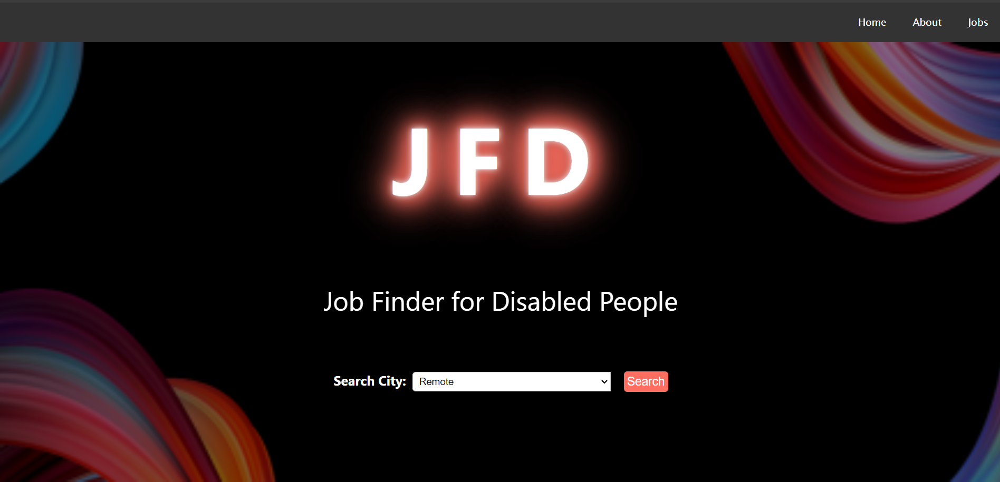

# JFD Project
<p align="center">
 <a href="https://web3templates.com/?ref=nextly_github_logo">
 
 </a> 
 <br>
 <br>
</p>

## JFD Website Architecture

JFD follows a structured architecture based on the Model-View-Controller (MVC) pattern. It includes the following components:

* **Controller Layer**: Handles incoming requests, delegates tasks to the service layer, and returns responses to clients. This includes endpoints for job listings and search functionalities.

* **Service Layer**: Contains business logic and coordinates tasks between the controller layer and the data access layer (repositories). It encapsulates operations related to job postings, searches, etc.

* **Repository Layer**: Manages database operations such as CRUD operations (Create, Read, Update, Delete). Uses Spring Data JPA to interact with the MySQL database.

* **Model**: Represents entities and DTOs (Data Transfer Objects) used within the application. Includes the `Job` entity.

* **View**: Utilizes Thymeleaf templates for rendering HTML pages on the client side. Templates are structured to display data based on user actions.

## Introduction
JFD is a project designed to provide a platform offering various jobs all over the USA for disabled people using the Java framework Spring Boot, connected to a MySQL database.

## Table of Contents
* [Introduction](#introduction)
* [Prerequisites](#prerequisites)
* [Installation](#installation)
* [Usage](#usage)
* [Features](#features)
* [Architecture](#architecture)
* [Contributing](#contributing)
* [Testing](#testing)
* [Deployment](#deployment)
* [FAQ](#faq)
* [License](#license)
* [Acknowledgements](#acknowledgements)
* [Contact](#contact)

## Prerequisites
- **Software**:
  - Java Development Kit (JDK) 8 or later
  - IntelliJ IDEA (Recommended IDE)
  - Apache Maven
  - Spring Boot
  - MySQL
  - Apache Tomcat
  - Thymeleaf
  - A text editor or Integrated Development Environment (IDE)

## Installation
1. **Clone the repository**:
    ```bash
    git clone https://github.com/yourusername/jfd.git
    cd jfd
    ```
2. **Set up the database**:
    - Create a MySQL database named `jobs`.
    - Create the necessary table within the `jobs` database: `job`.
    - Configure the `application.properties` file with your MySQL database credentials.

3. **Install dependencies**:
    ```bash
    mvn install
    ```
4. **Run the application**:
    ```bash
    mvn spring-boot:run
    ```

## Thymeleaf and Tomcat Configuration
* JFD utilizes Thymeleaf for server-side rendering of HTML templates and Apache Tomcat as the embedded servlet container provided by Spring Boot.

## Usage
1. **Access the application**:
    - Navigate to `http://localhost:9001` in your web browser.
2. **Search for jobs** by location or view all available jobs.

## Features
* Job listings across various locations in the USA.
* Search functionality to filter jobs by location.
* User-friendly interface with a dark theme for accessibility.

## Architecture

JFD's architecture is built upon modern web development principles, incorporating:

* **Backend Framework**: Spring Boot provides the foundation for robust backend services.
* **Database**: MySQL is used to persist data, ensuring reliability and scalability.
* **Design Pattern**: Follows a structured MVC (Model-View-Controller) pattern for clear separation of concerns.

### Detailed Architecture
For a more detailed breakdown, please look at the [JFD Website Architecture](#jfd-website-architecture) section for insights into its MVC implementation, security layers, and more.

## Contributing
1. **Fork the repository**.
2. **Create a new branch**:
    ```bash
    git checkout -b feature-branch
    ```
3. **Commit your changes**:
    ```bash
    git commit -m 'Add new feature'
    ```
4. **Push to the branch**:
    ```bash
    git push origin feature-branch
    ```
5. **Open a pull request**.

## Testing
* Run unit tests:
    ```bash
    mvn test
    ```
* Ensure all tests pass before submitting a pull request.

## FAQ
**Q: What if I encounter a compatibility issue during setup?**
A: Ensure all software versions meet the prerequisites and consult the official documentation for troubleshooting.

**Q: Does the project restrict access?**
A: The project currently does not have user authentication and authorization.

## License
This project is licensed under the MIT License.

## Acknowledgements
* Thanks to all the contributors and third-party libraries used in this project.

## Contact
For any inquiries or issues, please contact [farheenimam.offically@gmail.com].
